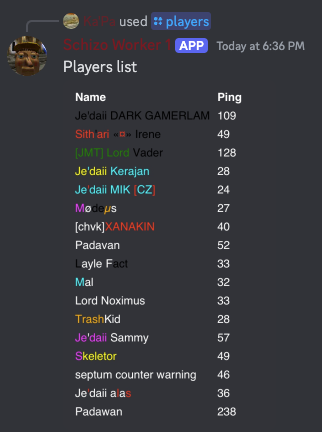

# discord-q3-status

Show player count from your Quake 3 based server through changing the name of a Discord channel on your guild.

Voice Channel with player count:


Responds to ```/player``` command with full player list.

Bot Response:


<br>
<br>


## 📖 Compatibility
Currently tested and working with Jedi Academy and Movie Battles II servers (Jedi Academy mod).  
Feel free to test with other Quake 3 games and raise an issue if you encounter any problems.

## 📋 Installation
To install the python requirements you have to run:
<br>
```pip install -r requirements.txt```

For the image generation with `IMGKit` to work you need to install `wkhtmltopdf` on your machine too. You can find instructions in the following links:

* https://github.com/jarrekk/imgkit
* https://wkhtmltopdf.org/downloads.html

## ⚙ Configuration
You'll need to create a bot and add it to your guild for the script to use.<br>
The bot just needs the manage "Manage Channels" permissions to work.

Also you'll need to create a channel for the script to rename with the status.<br>
People usually prefer using a voice channel as you don't have character limitations (you can use forward slash).

Then enter your specifics in config.py:
- `SERVER_IP`: Your Q3 based server IP
- `SERVER_PORT`: The port your server listens to
- `BOT_TOKEN`: The Discord bot token that you created for this
- `ENABLE_COUNT_CHANNEL`: whether you want the player count on a voice channel functionality enabled or not

The following are needed only if you set ```ENABLE_COUNT_CHANNEL=True```

- `DISCORD_COUNT_CHANNEL_ID`: The id of the Discord voice channel that it's name will be changed to show the player count
- `COUNT_UPDATE_INTERVAL`: The interval on which the bot will update the channel in seconds<br>
(right now Discord allows voice channel name change every 5 minutes, so 300 is the minimum possible value for now)

## 🚀 How to run
Just run the stats.py script: <br><br>
```python bot.py``` <br>&nbsp;or<br> ```python3 bot.py```<br><br>
Script logs events to file ```main.log```


